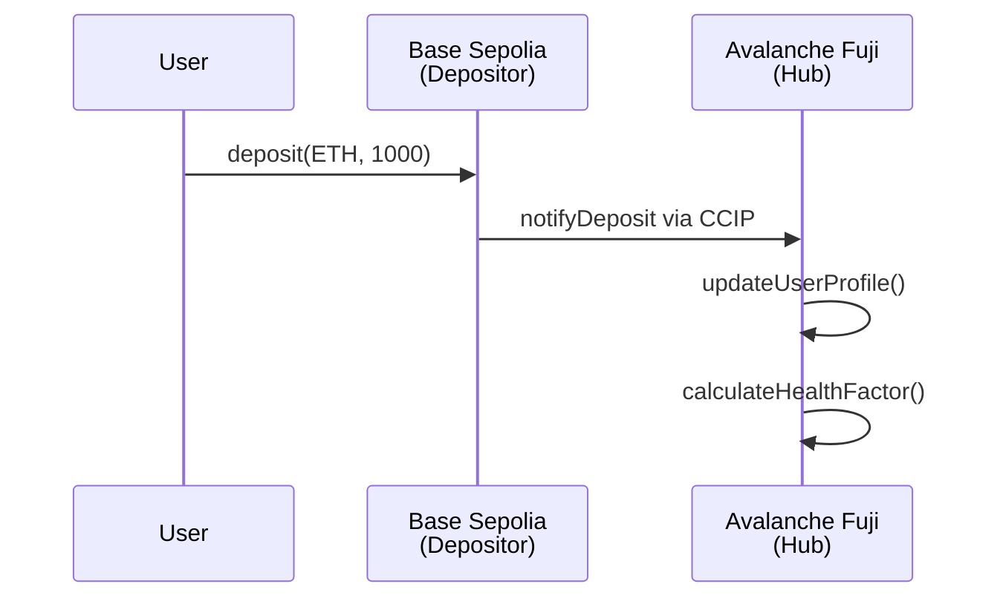
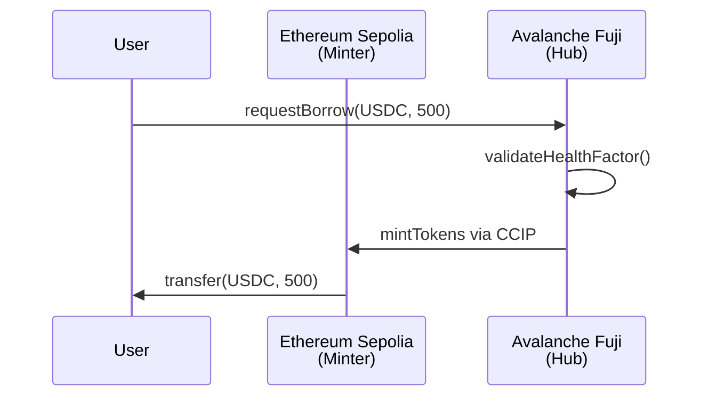

# CrossChainDefi Deployment Architecture Guide 🏗️

## 🎯 Overview

CrossChainDefi uses a **hub-spoke architecture** to enable efficient cross-chain operations while minimizing gas costs and complexity. This guide explains the correct deployment strategy.

## 🏛️ Architecture Model

### Hub-Spoke Design
```
                    🏛️  HUB CHAIN (Avalanche Fuji)
                    ┌─────────────────────────────┐
                    │  🏛️  CrossChainDefiHub      │
                    │  🤖 ArbitrageCoordinator   │
                    │  📊 MarketIntelligence      │
                    └─────────────────────────────┘
                               │ CCIP
                    ┌──────────┼──────────┐
                    │          │          │
        🔗 SPOKE CHAIN    🔗 SPOKE CHAIN    🔗 SPOKE CHAIN
        (Base Sepolia)    (Eth Sepolia)    (Future Chains)
        ┌──────────┐      ┌──────────┐      ┌──────────┐
        │ 💰 Depositor│      │ 💰 Depositor│      │ 💰 Depositor│
        │ 🏦 Minter  │      │ 🏦 Minter  │      │ 🏦 Minter  │
        └──────────┘      └──────────┘      └──────────┘
```

### Why Hub-Spoke Architecture?

✅ **Advantages:**
- **Centralized Logic**: All protocol logic and AI agents on one chain
- **Reduced Complexity**: Simpler cross-chain coordination
- **Lower Gas Costs**: Only necessary contracts on each chain
- **Easier Upgrades**: Upgrade hub contracts without touching all chains
- **AI Efficiency**: AI agents can analyze all chains from one location

❌ **Previous Monolithic Approach Problems:**
- Deploying ALL contracts on ALL chains
- Redundant AI agents across multiple chains
- High gas costs for deployment and maintenance
- Complex cross-contract coordination

## 📋 Contract Distribution

### 🏛️ Hub Chain: Avalanche Fuji

**Contracts Deployed:**
- `CrossChainDefiHub.sol` - Main protocol coordinator
- `ArbitrageCoordinatorAgent.sol` - AI-powered arbitrage detection
- `MarketIntelligenceAgent.sol` - Market analysis and insights

**Responsibilities:**
- User profile management
- Health factor calculations
- Credit scoring coordination
- AI agent coordination
- Cross-chain message routing
- Risk management and liquidations

### 🔗 Spoke Chains: Base Sepolia, Ethereum Sepolia

**Contracts Deployed:**
- `CrossChainDepositor.sol` - Collateral management
- `CrossChainMinter.sol` - Token minting/borrowing

**Responsibilities:**
- Collateral deposits and withdrawals
- Token minting for borrowing
- Local yield strategies
- Cross-chain messaging to hub

## 🚀 Deployment Scripts

### 1. Hub Deployment Script: `deploy-hub.js`

**Purpose:** Deploy hub contracts on Avalanche Fuji

**Usage:**
```bash
# Deploy hub contracts
bun run deploy:hub
# or
bunx hardhat run scripts/deploy-hub.js --network fuji
```

**What it deploys:**
- CrossChainDefiHub
- ArbitrageCoordinatorAgent  
- MarketIntelligenceAgent
- Sets up agent relationships and roles

### 2. Spoke Deployment Script: `deploy-spoke.js`

**Purpose:** Deploy spoke contracts on Base Sepolia, Ethereum Sepolia

**Usage:**
```bash
# Deploy to Base Sepolia
bun run deploy:spoke:base
# or
bunx hardhat run scripts/deploy-spoke.js --network baseSepolia

# Deploy to Ethereum Sepolia  
bun run deploy:spoke:sepolia
# or
bunx hardhat run scripts/deploy-spoke.js --network sepolia
```

**What it deploys:**
- CrossChainDepositor
- CrossChainMinter
- Configures connection to hub chain

## 📝 Deployment Process

### Step 1: Deploy Hub Chain ✅ (COMPLETED)

```bash
# Deploy hub contracts to Avalanche Fuji
cd contracts
bun run deploy:hub
```

**Expected Output:**
```
🏛️  DEPLOYING HUB CONTRACTS TO FUJI...
🏗️  Step 1: Deploying CrossChainDefiHub
🤖 Step 2: Deploying ArbitrageCoordinatorAgent  
📊 Step 3: Deploying MarketIntelligenceAgent
🔗 Step 4: Setting up AI agent relationships
✅ HUB DEPLOYMENT COMPLETED SUCCESSFULLY!
```

### Step 2: Deploy Spoke Chains

#### Base Sepolia (Waiting for Funding)
```bash
# Check wallet balance first
bun run check-balance:base-sepolia

# Deploy when funded (need ~0.1 ETH)
bun run deploy:spoke:base
```

#### Ethereum Sepolia (Ready)
```bash
# Deploy spoke contracts
bun run deploy:spoke:sepolia
```

### Step 3: Complete Deployment
```bash
# Deploy to all chains in correct order
bun run deploy:all
```

## 🔧 Configuration Files

### Modified Files for New Architecture:

1. **`deployment.config.js`** - Added spoke chain configuration
2. **`package.json`** - Updated deployment scripts
3. **`scripts/deploy-hub.js`** - New hub-only deployment
4. **`scripts/deploy-spoke.js`** - New spoke-only deployment

### Network Configuration:

```javascript
DEPLOYMENT_CONFIG = {
  networks: ['fuji', 'baseSepolia', 'sepolia'],
  hubChain: 'fuji',
  spokeChains: ['baseSepolia', 'sepolia']
}
```

## 📊 Current Deployment Status

| Chain | Type | Status | Contracts |
|-------|------|--------|-----------|
| Avalanche Fuji | Hub | ✅ **Deployed** | Hub + 2 AI Agents |
| Base Sepolia | Spoke | ⏳ **Waiting for Funding** | Depositor + Minter |
| Ethereum Sepolia | Spoke | 📋 **Ready to Deploy** | Depositor + Minter |

### Avalanche Fuji (Hub) - ✅ DEPLOYED
```
CrossChainDefiHub           : 0x2519bA8D5f7F64fACC712abc32195FA3a53c02ab
ArbitrageCoordinatorAgent   : 0xD103937FEaf0DF4c8ADD4fe28Cfc7830B66DF919  
MarketIntelligenceAgent     : 0xB7F02024F2B8F3050440D2191f290eF635236520
```

## 🔄 Cross-Chain Flow

### User Deposit Flow:


### User Borrow Flow:


## 🛠️ Post-Deployment Setup

### 1. Cross-Chain Configuration
```bash
# Set allowed senders for CCIP messaging
# Register spoke contracts with hub
# Configure supported tokens
```

### 2. Chainlink Services Setup
```bash
# Fund VRF subscriptions with LINK
# Add consumer contracts to subscriptions  
# Configure Functions DON access
```

### 3. Testing
```bash
# Test cross-chain deposits
# Test cross-chain borrowing
# Verify AI agent functionality
```

## 📚 Key Benefits of New Architecture

### For Developers:
- **Clearer separation of concerns**
- **Easier testing and debugging**
- **Simplified deployment process**
- **Better code organization**

### For Users:
- **Lower gas costs**
- **Faster transactions**
- **Better user experience**
- **More reliable cross-chain operations**

### For Protocol:
- **Easier maintenance**
- **Simpler upgrades**
- **Better scalability**
- **Reduced operational complexity**

## 🚨 Important Notes

1. **Deploy Hub First**: Always deploy hub contracts before spoke contracts
2. **Hub Address Required**: Spoke contracts need hub contract address during deployment
3. **Network Validation**: Scripts validate correct network for deployment type
4. **Cross-Chain Setup**: Additional configuration required after initial deployment

## 🔗 Next Steps

1. ✅ Hub deployed on Avalanche Fuji
2. ⏳ Fund Base Sepolia wallet
3. 📋 Deploy spoke contracts to Base Sepolia
4. 📋 Deploy spoke contracts to Ethereum Sepolia
5. 📋 Configure cross-chain messaging
6. 📋 Test end-to-end functionality

This architecture provides a solid foundation for scaling CrossChainDefi across multiple blockchains while maintaining efficiency and simplicity. 